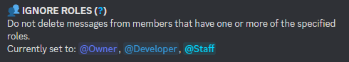

# 🔂 Filter Behavior

Choose to either

1. delete only messages that match **AT LEAST ONE** activated [filter](filters.md) or
2. delete only messages that match **ALL** activated [filters](filters.md).


Default is to: `Match one activated filter`


<figure><figcaption></figcaption></figure>
